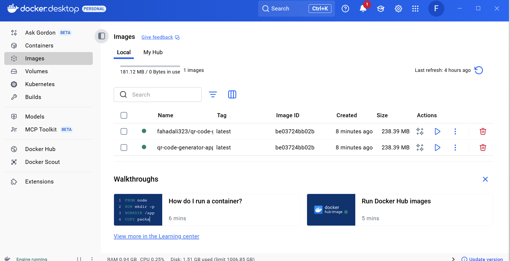
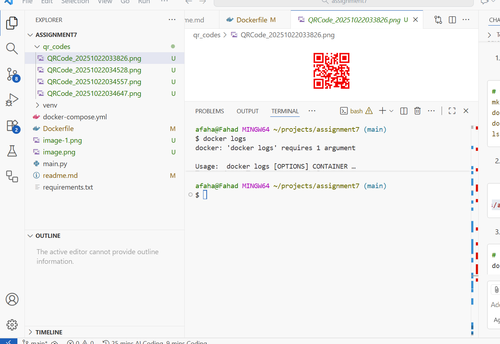

# Module 7 

## Github Repository 

## My DockerHub Image

## Submissions Images

## Challenges 
The one challenge I faced during this module was working with dockers and how to properly work with the command in particular:
 docker run -v ./qr_codes:/app/qr_codes fahadali323/qrcode_maker 

the output says a successful Qr code was successfully save to qr_codes. However, upon looking into dictory, I see a new directory being created qr_codes;C which is not the correct output based on the video itself. 
The issue was that I was using git bash to run the command and it resulted in a weird behavior but when running the same command in WSL, I got the correct result. 